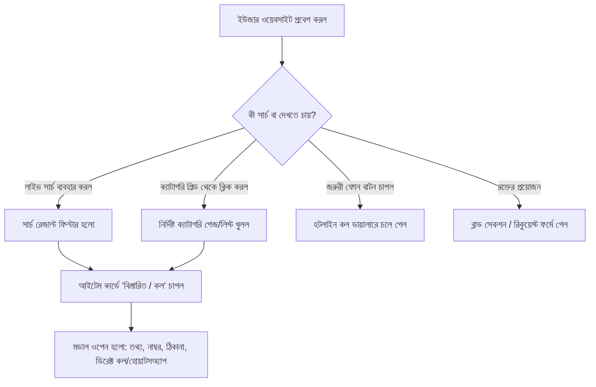
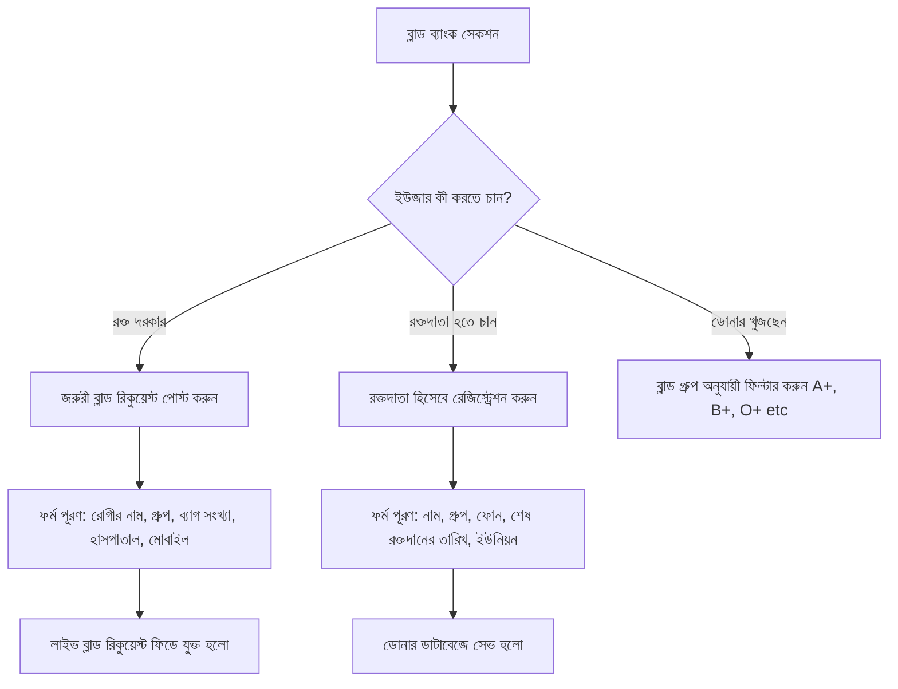
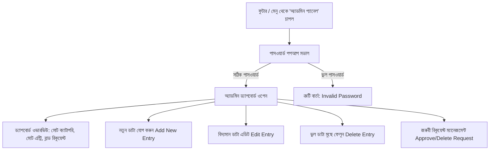

# 📱 আমার সিরাজদিখান - বিস্তারিত অ্যাপ্লিকেশন ফ্লো ডকুমেন্টেশন (Application Flow Architecture)

এই নথিতে **"আমার সিরাজদিখান"** উপজেলা ওয়েব অ্যাপ্লিকেশনের বিস্তারিত কার্যপ্রণালী, স্ক্রিন নেভিগেশন, বাটন অ্যাকশন, ইউজার ফ্লো এবং অ্যাডমিন ফ্লো পেশাদারভাবে বর্ণনা করা হয়েছে।

---

## 📑 সুচিপত্র (Table of Contents)
1. [ওয়েবসাইট ওভারভিউ ও আর্কিটেকচার](#১-ওয়েবসাইট-ওভারভিউ-ও-আর্কিটেকচার)
2. [সাধারণ ব্যবহারকারী ফ্লো (User Flow)](#২-সাধারণ-ব্যবহারকারী-ফ্লো-user-flow)
3. [জরুরী ও স্বাস্থ্যসেবা ফ্লো (Emergency & Healthcare Flow)](#৩-জরুরী-ও-স্বাস্থ্যসেবা-ফ্লো-emergency--healthcare-flow)
4. [রক্তদান ও রিকুয়েস্ট ফ্লো (Blood Donation & Request Flow)](#৪-রক্তদান-ও-রিকুয়েস্ট-ফ্লো-blood-donation--request-flow)
5. [কারিগরি ও পেশাজীবী মেস্ত্রী সেবা ফ্লো (Craftsmen & Professional Services Flow)](#৫-কারিগরি-ও-পেশাজীবী-মেস্ত্রী-সেবা-ফ্লো-craftsmen--professional-services-flow)
6. [অ্যাডমিন ফ্লো ও ড্যাশবোর্ড (Admin Flow & Dashboard Management)](#৬-অ্যাডমিন-ফ্লো-ও-ড্যাশবোর্ড-admin-flow--dashboard-management)
7. [ক্লিক-বাই-ক্লিক নেভিগেশন ম্যাপিং (Click-by-Click Action Matrix)](#৭-ক্লিক-বাই-ক্লিক-নেভিগেশন-ম্যাপিং-click-by-click-action-matrix)

---

## ১. ওয়েবসাইট ওভারভিউ ও আর্কিটেকচার

অ্যাপ্লিকেশনটি **একক পেজ অ্যাপ্লিকেশন (Single Page Application - SPA)** স্টাইলে ডিজাইন করা হয়েছে, যাতে ব্যবহারকারী কোনো পেজ রিলোড ছাড়াই দ্রুত সমস্ত সুবিধা উপভোগ করতে পারেন।

### মূল বিভাগসমূহ:
- **হেডার ও নেভিগেশন বার**: লোগো, সার্চ বার, লাইট/ডার্ক মোড টগল, জরুরী হটলাইন বাটন, ব্লাড পোস্ট বাটন, অ্যাডমিন লগইন।
- **হিরো সেকশন**: লাইভ সার্চ ফিল্ড, দ্রুত হটলাইন কালেকশন (ইউএনও, থানা, ফায়ার সার্ভিস, অ্যাম্বুলেন্স)।
- **ক্যাটাগরি গ্রিড (৫০+ ক্যাটাগরি)**: হাসপাতাল, ডাক্তার, মেস্ত্রী, শিক্ষা, পরিবহন, কেনাকাটা ইত্যাদি।
- **জরুরী ব্লাড ব্যাংক বিজগেটেরিয়া**: সক্রিয় রক্ত সংগ্রাহক ও রক্তদাতাদের ফিল্টারসহ তালিকা।
- **অ্যাকশন মডালসমূহ (Modals)**: ডিটেইলস কার্ড, সরাসরি কল করা, হোয়াটসঅ্যাপ মেসেজিং, নতুন ডোনার রেজিস্ট্রেশন, ব্লাড রিকুয়েস্ট সাবমিট, অ্যাডমিন প্যানেল।
- **মোবাইল বটম নেভিগেশন বার**: হোম, ক্যাটাগরি, রক্তদান, হটলাইন, অ্যাডমিন।

---

## ২. সাধারণ ব্যবহারকারী ফ্লো (User Flow)

### বিস্তারিত ধাপসমূহ:
1. **হোমপেজ ল্যান্ডিং**: ব্যবহারকারী হোমপেজে প্রবেশ করলে উপরের দিকে একটি সুন্দর সার্চ বক্স এবং নিচে ৫০+টি ভিজ্যুয়াল ক্যাটাগরি কার্ড দেখতে পাবেন।
2. **সার্চিং (Live Search)**: ব্যবহারকারী সার্চ বক্সে যেকোনো শব্দ (যেমন: *"ইলেকট্রিক"*, *"অ্যাম্বুলেন্স"*, *"ডাক্তার"*, *"বিউটি পার্লার"*) লিখলেই নিচের সমস্ত কার্ড রিয়েল-টাইমে ফিল্টার হয়ে যাবে।
3. **ক্যাটাগরি নির্বাচন**: যেকোনো ক্যাটাগরি (যেমন: `হাসপাতাল` বা `ইলেকট্রিক মেস্ত্রী`) কার্ডে ক্লিক করলে উক্ত ক্যাটাগরির অধীনে নিবন্ধিত সকল ব্যক্তি/প্রতিষ্ঠানের কার্ডের তালিকা পপআপ মডালে অথবা স্ক্রিনে প্রদর্শিত হবে।
4. **বিস্তারিত দেখা ও যোগাযোগ**:
   - **"কল করুন" বাটন**: ক্লিক করলে মোবাইলের ডায়ালারে (`tel:`) সরাসরি নম্বরটি উঠে যাবে।
   - **"হোয়াটসঅ্যাপ" বাটন**: ক্লিক করলে ওই নম্বরের হোয়াটসঅ্যাপে সরাসরি চ্যাট লিংক (`https://wa.me/...`) খুলবে।
   - **"ম্যাপ / ঠিকানা"**: প্রতিষ্ঠানের অবস্থান ও সেবা দেয়ার সময়সূচী দেখা যাবে।

---

## ৩. জরুরী ও স্বাস্থ্যসেবা ফ্লো (Emergency & Healthcare Flow)

### ১. ফাস্ট-অ্যাক্সেস ইমার্জেন্সি বার:
- হোমপেজের শীর্ষভাগে ৩টি বড় কন্টাক্ট বাটন থাকবে:
  - 🚨 **থানা (Police Station)** -> `01713398600` (উদাহরণ)
  - 🚒 **ফায়ার সার্ভিস (Fire Service)** -> `01711002233`
  - 🚑 **২৪/৭ অ্যাম্বুলেন্স** -> অ্যাম্বুলেন্স তালিকা মডাল
  - ⚡ **পল্লী বিদ্যুৎ অভিযোগ** -> সরাসরি অভিযোগ কেন্দ্র নম্বর

### ২. স্বাস্থ্যসেবা (হাসপাতাল, ক্লিনিক, ডায়াগনস্টিক, ডাক্তার):
- **হাসপাতাল/ক্লিনিক**: ক্লিক করলে সরকারী উপজেলা স্বাস্থ্য কমপ্লেক্স এবং বেসরকারী ক্লিনিকের ওয়ার্ড, আইসিইউ ও অ্যাম্বুলেন্স তথ্য দেখা যাবে।
- **বিশেষজ্ঞ ডাক্তার**: বিষয়ভিত্তিক ফিল্টার (মেডিসিন, গাইনী, শিশু, কার্ডিওলজি, চর্ম) অনুযায়ী ডাক্তারদের চেম্বার, দেখার সময় এবং সিরিয়াল দেওয়ার নম্বর মিলবে।

---

## ৪. রক্তদান ও রিকুয়েস্ট ফ্লো (Blood Donation & Request Flow)

### ১. রক্তদাতা খোঁজা (Search Donors):
- ব্যবহারকারী ব্লাড গ্রুপ বেছে নেবেন (যেমন: `B+` বা `O-`)।
- শুধুমাত্র প্রস্তুত থাকা (Ready to donate, অর্থাৎ ৩ মাসের মধ্যে রক্ত দেননি) রক্তদাতাদের নাম, ফোন নম্বর ও ইউনিয়নের নাম ভেসে উঠবে।

2. **জরুরী ব্লাড রিকুয়েস্ট (Urgent Request)**:
- "রক্তের আবেদন করুন" বাটনে ক্লিক।
- রোগীর নাম, ব্লাড গ্রুপ, কত ব্যাগ প্রয়োজন, কোন হাসপাতালে ভর্তি, যোগাযোগের নম্বর ও কতদিনের মধ্যে প্রয়োজন তা লিখে সাবমিট করা।
- সাবমিট করার সাথে সাথে অ্যাপের "জরুরী রক্তের রিকুয়েস্ট" নোটিশ বোর্ডে তা লাইভ হয়ে যাবে।

---

## ৫. কারিগরি ও পেশাজীবী মেস্ত্রী সেবা ফ্লো (Craftsmen & Professional Services Flow)

উপজেলার সকল কারিগরদের দ্রুত পাওয়ার জন্য আলাদা একটি সুসংগঠিত ফ্লো রাখা হয়েছে:

### তালিকাভুক্ত পেশাজীবী মেস্ত্রীসমূহ:
1. **ইলেকট্রিক মেস্ত্রী** (ওয়ারিং, ফ্যান-লাইটিং, জেনারেটর মেকানিক)
2. **স্যানিটারি মেস্ত্রী** (পাইপ ফিটিং, টয়লেট-বেসিন মেরামতের টেকনিশিয়ান)
3. **টাইলস মেস্ত্রী** (মেঝে ও দেয়ালের টাইলস ফিটিং)
4. **দরজি কারিগর** (লেডিস ও জেন্টস দর্জি)
5. **কাঠের মেস্ত্রী** (ফার্নিচার তৈরি ও ডোর ফিটিং)
6. **অটোরিক্সা মেস্ত্রী** (ইজি বাইক, অটোরিকশার ব্যাটারি ও মোটর মেরামতি)
7. **পেইন্ট মেস্ত্রী** (বাসাবাড়ির রং ও পুটিং কারিগর)
8. **টায়ার মেস্ত্রী** (টায়ার লিক ও পাংচার মেরামত)
9. **মোটর মেস্ত্রী** (বাইক, প্রাইভেটকার ও ইঞ্জিন মেরামত)

### ইউজার অ্যাকশন:
- ক্যাটাগরিতে ক্লিক করলে মেস্ত্রীর নাম, ছবি (যদি থাকে), অভিজ্ঞতার বছর, কাজের এলাকা (যেমন: রাজানগর, শেখরনগর, কোলা, চালতিাপাড়া) এবং সরাসরি কলের বাটন আসবে।

---

## ৬. অ্যাডমিন ফ্লো ও ড্যাশবোর্ড (Admin Flow & Dashboard Management)

অ্যাডমিন হলেন সিস্টেমের মূল নিয়ন্ত্রক। তিনি যেকোনো তথ্য পরিবর্তন, পরিমার্জন বা বর্জন করতে পারবেন।

### অ্যাডমিন প্যানেলের ক্ষমতা ও বৈশিষ্ট্য:
1. **নতুন এন্ট্রি যোগ করা (Add Listing)**:
   - ক্যাটাগরি সিলেক্ট করুন (যেমন: `হাসপাতাল`, `ইলেকট্রিক মেস্ত্রী`, `ফার্মেসী`)।
   - নাম, ফোন নম্বর, ঠিকানা, বিবরণ, ছবি URL ইত্যাদি ইনপুট দিয়ে "সংরক্ষণ করুন" এ চাপ দিলে অবিলম্বে তা প্রধান ওয়েবসাইটে লাইভ দেখা যাবে।
2. **এডিট করা (Edit Listing)**:
   - বিদ্যমান যেকোনো কার্ডের পাশে থাকা ✏️ **এডিট** বাটনে ক্লিক করে তথ্য সংশোধন করা যাবে।
3. **ডিলিট করা (Delete Listing)**:
   - ভুয়া বা পুরানো তথ্য 🗑️ **ডিলিট** বাটনে ক্লিক করে কনফার্মেশনের মাধ্যমে মুছে ফেলা যাবে।
4. **ডাটা রিস্টোর / রিসেট (Reset Data)**:
   - প্রয়োজনে অ্যাডমিন ডিফল্ট ডাটাবেজে রিস্টোর করার সুবিধা পাবেন।

---

## ৭. ক্লিক-বাই-ক্লিক নেভিগেশন ম্যাপিং (Click-by-Click Action Matrix)

| ট্রিগার / এলিমেন্ট (Where Clicked) | ভিজ্যুয়াল পেজ / মডাল (What Opens) | প্রধান কাজ / অ্যাকশন (Result Action) |
| :--- | :--- | :--- |
| **লোগো ("আমার সিরাজদিখান")** | হোম পেজ | পেজ স্ক্রল টপ হয় এবং সকল ক্যাটাগরি রিসেট হয়ে দৃশ্যমান হয়। |
| **সার্চ বক্স (Search Input)** | লাইভ ফিল্টারিত ভিউ | টাইপ করা সাথে সাথে ম্যাচিং ক্যাটাগরি ও সার্ভিস কার্ডগুলো শো করে। |
| **ক্যাটাগরি কার্ড (Category Card)** | ক্যাটাগরি ডিটেইলস মডাল | উক্ত ক্যাটাগরির অন্তর্ভুক্ত সকল ডাটা লিস্ট আকারে দেখায়। |
| **"কল করুন" বাটন (Call Now)** | ফোন ডায়ালার | মোবাইলের সিম ডায়ালারে সার্ভিস প্রোভাইডারের নম্বর চলে যায়। |
| **"হোয়াটসঅ্যাপ" বাটন (WhatsApp)** | হোয়াটসঅ্যাপ অ্যাপ্লিকেশন | নির্দিষ্ট নম্বরের চ্যাট উইন্ডো সরাসরি ওপেন হয়। |
| **"রক্তের প্রয়োজন?" বাটন** | ব্লাড রিকুয়েস্ট মডাল | ব্লাড গ্রুপ ও রোগীর তথ্য দেওয়ার ফর্ম খোলে। |
| **"রক্তদাতা হতে চাই" বাটন** | ডোনার রেজিস্ট্রেশন মডাল | নতুন রক্তদাতার প্রোফাইল সাবমিট করার ফর্ম খোলে। |
| **"জরুরী হটলাইন" বাটন** | হটলাইন মডাল / লিস্ট | ইউএনও, থানা, ফায়ার সার্ভিস, অ্যাম্বুলেন্সের কুইক নম্বর দেখায়। |
| **"অ্যাডমিন প্যানেল" বাটন** | অ্যাডমিন পাসওয়ার্ড ফর্ম | পাসওয়ার্ড পাস করলে অ্যাডমিন কন্ট্রোল রুম মডাল খুলে যায়। |
| **অ্যাডমিন: "নতুন তথ্য যোগ করুন"** | ডাটা ক্রিয়েশন ফর্ম | যেকোনো ক্যাটাগরিতে নতুন ডাটা যুক্ত করার ফর্ম প্রদর্শন করে। |
| **অ্যাডমিন: "এডিট" বাটন** | আপডেট ফর্ম | নির্বাচিত আইটেমের বিদ্যমান তথ্য ফর্মে লোড করে পরিবর্তনের সুযোগ দেয়। |
| **অ্যাডমিন: "ডিলিট" বাটন** | কনফার্মেশন অ্যালার্ট | নিশ্চিত হলে ডাটা স্থায়ীভাবে ডাটাবেজ থেকে রিমুভ করে। |
| **থিম টগল বাটন (🌙/☀️)** | বিশ্বজনীন থিম পরিবর্তন | লাইট ও ডার্ক মোডের মধ্যে সুইচ করে। |

---

> **নোট**: এই আর্কিটেকচারটি অত্যন্ত ফ্লেক্সিবল। ব্রাউজারের `LocalStorage` ব্যবহার করায় কোনো সার্ভার ছাড়াও সম্পূর্ণ অফলাইন/অনলাইনে তাৎক্ষণিকভাবে চমৎকার পারফর্ম করবে।
